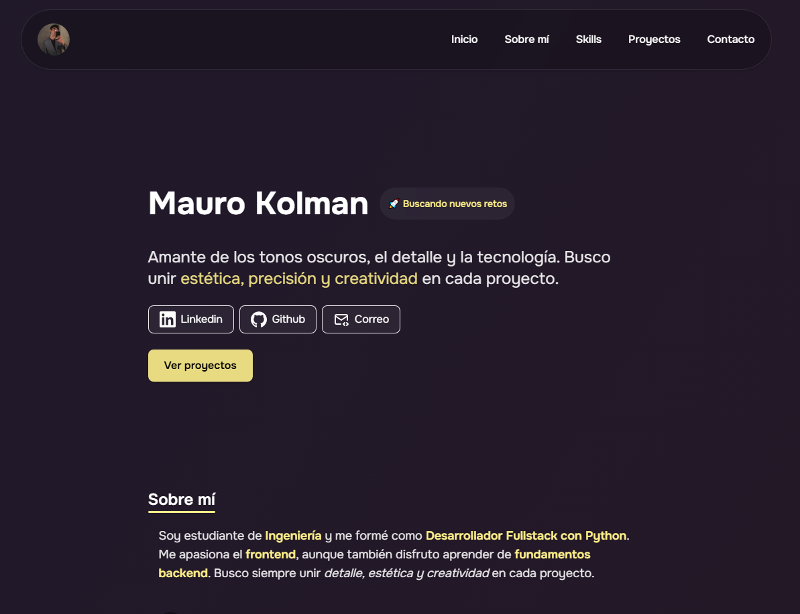

# 👨‍💻 Portfolio Personal - Mauro Kolman


Bienvenido al repositorio de mi portafolio personal. Este proyecto está diseñado para mostrar mis habilidades, experiencia y los proyectos que he desarrollado como Desarrollador Web.

## 🚀 Demo en vivo

Puedes ver el sitio desplegado aquí:
👉 **[https://mauk-portfolio.netlify.app/](https://mauk-portfolio.netlify.app/)**

---

## 📸 Captura de Pantalla



---

## 🛠️ Tecnologías Utilizadas

Este portafolio fue construido utilizando las siguientes herramientas y tecnologías:

* **Core:** [ Astro ]
* **Estilos:** [ Tailwind CSS ]
* **Deploy:** Netlify

## ✨ Funcionalidades

* **Diseño Responsivo:** Adaptable a dispositivos móviles y escritorio.
* **Formulario de Contacto:** Funcional e integrado.
* **Showcase de Proyectos:** Sección dinámica con mis trabajos recientes.

---

## 🔧 Instalación y Configuración Local

Si deseas clonar y ejecutar este proyecto localmente, sigue estos pasos:

1.  **Clonar el repositorio:**
    ```bash
    git clone [https://github.com/RedBoth/my-portfolio.git](https://github.com/RedBoth/my-portfolio.git)
    ```

2.  **Instalar dependencias:**
    ```bash
    cd my-portfolio
    npm install
    ```

3.  **Ejecutar el servidor de desarrollo:**
    ```bash
    npm run dev
    ```

4.  Abrir en el navegador: `http://localhost:3000` (o el puerto que te indique la consola).

---

## 📬 Contacto

Si tienes alguna pregunta o quieres contactar conmigo:

* **LinkedIn:** [LinkedIn](https://www.linkedin.com/in/mauro-kolman/)
* **Email:** [Email](mailto:mauro.kolman1255@gmail.com)
* **GitHub:** [RedBoth](https://github.com/RedBoth)

---

Hecho con ❤️ por **Mauro Kolman**.